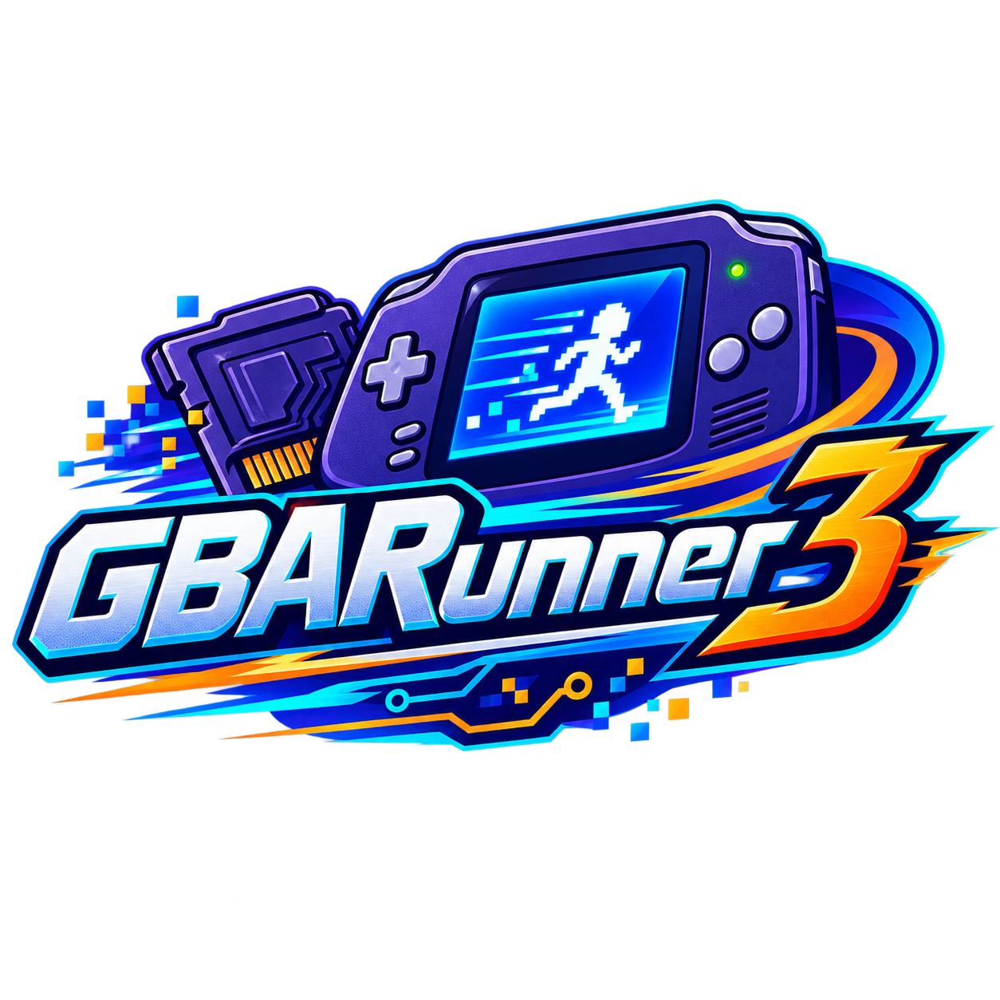

# GBARunner3



GBARunner3 runs Game Boy Advance software on Nintendo DS-family hardware by
combining direct execution, instruction patching, and emulation of hardware that
cannot be exposed directly. It is still under development: compatibility varies
by title, console mode, storage device, launcher, and ROM revision.

This fork tracks the upstream [`Gericom/GBARunner3`](https://github.com/Gericom/GBARunner3)
project and adds the RTC and high-ROM compatibility work submitted upstream as
[pull request #210](https://github.com/Gericom/GBARunner3/pull/210).

## Current custom release

The current stable custom release is
[`custom-v0.1.3`](https://github.com/GimoXagros/GBARunner3/releases/tag/custom-v0.1.3).
It promotes the strict JSON validation and build hardening from RC1. Its normal
`GBARunner3.nds` is byte-identical to RC1 and the RC2 control:
`9968bb423430b2fcfc6aacec70a5c2e5603f711952c6eb2d6c57fbfac287a3b2`.

On 2026-09-13, the user confirmed that both distorted output and flicker were
absent after the temporary display-comparison setting was removed and defaults
were restored. This is an observed recovery in the reported setup, not evidence
of a new display/IRQ code fix or a full compatibility pass. The exact executable
hash for that hardware session was not supplied. See the
[release and investigation record](docs/v013-release.md).

The stable package contains one normal executable, the same 304 title configs,
installation notes and checksums. It contains no diagnostic executable and no
global `gbarunner3.json`. RC1/RC2 and previous stable releases remain available.
Draft PRs [#5](https://github.com/GimoXagros/GBARunner3/pull/5) and
[#6](https://github.com/GimoXagros/GBARunner3/pull/6) remain excluded.

## Changes in this fork

- Enables the upstream high-ROM instruction-cache mapping work and fixes ARM
  B/BL/BX transitions across the 2 MiB linear ROM window.
- Resets high-ROM JIT metadata when an SD-cache block is reused.
- Preserves ARM/Thumb state for undefined instructions in mapped high-ROM code
  and selects the correct Thumb halfword.
- Resolves dynamic Thumb JIT metadata and patch writes to the loaded SD-cache
  backing block.
- Unmaps the hicode MPU region before whole instruction-cache invalidation.
- Implements cartridge GPIO RTC transactions using the DS clock through ARM7
  IPC.
- Persists RTC offset, weekday, status, and interrupt state in a validated
  per-ROM `.g3rtc` sidecar, with temporary and backup-file recovery.
- Searches high-ROM regions for save routines that need patching.
- Creates adjacent `.sav` files without modifying the launcher-owned ROM path,
  initializes new or short saves with `0xFF`, and checks initialization I/O.
- Uses UTF-8 FatFs long filenames, including Korean ROM filenames.
- Adds regression tests for ARM PC+8 branch calculation and high-ROM boundary
  handling.

## Installation

1. Download `GBARunner3.zip` from `custom-v0.1.3` and check its release hashes.
   Preserve existing saves and settings before updating.
2. Copy `GBARunner3.nds` to the location expected by your launcher.
3. Merge the included `_gba/configs` directory into `/_gba/configs` on the SD
   card.
4. Place a legally obtained GBA BIOS at `/_gba/bios.bin`.
5. Launch a `.gba` file through a frontend that passes the ROM path to
   GBARunner3. The tested setup used a DSpico/Pico Launcher file association.

GBARunner3 has no bundled commercial ROMs or BIOS. If a frontend does not pass
a ROM path, the current fallback path is `/rom.gba`.

## Configuration

The global `/_gba/gbarunner3.json` is optional; absent settings use defaults.
Keep unrelated personal settings when updating. If the temporary RC2 comparison
file containing only `enableCenterAndMask=false` is still active, move that test
file aside to restore the original defaults. This option changes centering,
masking and engine selection; it does not stop VBlank capture housekeeping.

Global settings are read from `/_gba/gbarunner3.json`. Per-title settings use
`/_gba/configs/GAMECODEVV.json`, where `GAMECODE` is the four-character GBA game
code and `VV` is the two-digit revision.

The current parser supports display placement and correction, JIT and cache
switches, manual JIT/self-modifying-code patch addresses, BIOS-intro skipping,
DS-mode ARM9 clock selection, and forced save type. See the JSON files in
[`configs`](configs) for per-title examples.

`custom-v0.1.3-rc1` validates external patch-address strings
strictly: 1–8 hexadecimal digits with optional `0x`/`0X`. A malformed address or
non-string entry rejects that entire array and preserves its previous/default
value. See [patch-address format](docs/config-patch-addresses.md). The published
`custom-v0.1.2` binary retains its original behavior.

## Hardware verification

The v0.1.2 NDS above was verified on Nintendo 3DS in DS mode using DSpico with
Kingdom Hearts: Chain of Memories `[B8CJ][K]`:

```text
Main Menu -> New Game -> Save Slot
```

The black horizontal lines, screen flicker, and irregular audio clicks seen in
a rejected diagnostic build were absent in the other games checked during this
run. B8CJ exposed and verified a generic mapped high-ROM Thumb/JIT error; the
production fix contains no title-specific path.

The following B8CJ steps have not yet been verified with v0.1.2: slot selection,
intro completion, gameplay, save, restart, load, and a full playthrough.

### Historical rc5 regression baseline

The following Korean-patched revisions were reported to start and run normally
with the exact rc5 NDS above:

| Game | Code | Tested revision |
| --- | --- | --- |
| Rhythm Tengoku | `BRIK` | Rev.1 / 1.34.1.1 |
| Made in Wario | `AZWJ` | Arumi / 2012-12-31 |
| Tales of the World: Narikiri Dungeon 3 | `B3TJ` | 1.1 |
| Fire Emblem: The Sacred Stones | `BE8K` | 0.621.1 / 2024-09-22 |
| Pokémon FireRed | `BPRE` | 2026-06-13 |
| Pokémon Emerald | `BPEE` | 2026-06-13 |
| Kingdom Hearts: Chain of Memories | `B8CJ` | Iyagi patch |

The rc5 evidence covers normal startup and observed runtime only. It is not a
full-playthrough, exhaustive save-format, or exhaustive RTC certification.
Tales of the World: Narikiri Dungeon 2 is excluded because the tested patched
image is suspected to be malformed; its save behavior belongs to a separate
investigation.

## Known limitations

- RTC persistence now has format/corruption/time-transition regression coverage,
  but cold-start behavior and write recovery still require hardware verification
  on DSpico/3DS.
- Several save implementations and region/ROM-hack combinations still require
  issue-specific hardware retesting.
- Some upstream compatibility, timing, sound, JIT, DMA, and application-feature
  issues remain open.
- The upstream repository has not declared a repository-wide license. Read
  [`LICENSE.md`](LICENSE.md) before modifying or redistributing source or
  binaries.

The issue comparison and prioritized work list are maintained in
[`TODO.md`](TODO.md).

## Building

Clone recursively and use the official reference toolchain,
`devkitpro/devkitarm:20241104`, as in CI. The RC includes dependency-order fixes:
two clean builds each at serial (`-j1`), `-j2`, and `-j4` produced identical
application and test NDS files in the
[build audit](docs/build-reproducibility.md). These parallel-build results apply
to the corrected RC source. The latest toolchain remains an optional,
non-blocking experiment.

```sh
git clone --recursive https://github.com/GimoXagros/GBARunner3.git
cd GBARunner3
docker run --rm -v "$PWD:/src" -w /src devkitpro/devkitarm:20241104 make -C code debug
```

The application output is `code/bootstrap/GBARunner3.nds`; the `debug` target
also builds the GoogleTest NDS. The v0.1.2 release source was built successfully
by the application and test targets in the pinned container. The `develop` build
and semantic test passed in
[CI build 33939033107](https://github.com/GimoXagros/GBARunner3/actions/runs/33939033107),
and the release packaging passed in
[CI build 33939047544](https://github.com/GimoXagros/GBARunner3/actions/runs/33939047544).

## Contributing and issue reports

Upstream issues are tracked at
[`Gericom/GBARunner3/issues`](https://github.com/Gericom/GBARunner3/issues).
Reports should include the exact GBARunner3 commit or NDS hash, console and mode,
launcher/storage path, ROM game code and revision, save type, reproduction steps,
and the first observable failure. Do not upload commercial ROMs or BIOS files.
