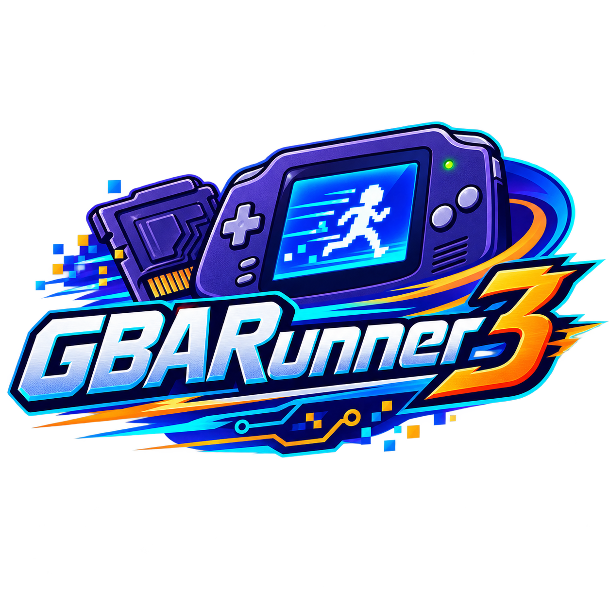

# GBARunner3 Custom



A GBA Hypervisor for DS. GBARunner3 runs Game Boy Advance software on Nintendo
DS-family hardware through direct execution, instruction patching and hardware
emulation. This custom distribution builds on
[Gericom/GBARunner3](https://github.com/Gericom/GBARunner3); compatibility varies
by title, ROM revision, console mode, storage device and launcher.

## Current stable release

[**Download custom-v0.1.5**](https://github.com/GimoXagros/GBARunner3/releases/tag/custom-v0.1.5)
is the recommended stable release. It includes the RTC BCD correction, explicit
legacy RTC compatibility and ARM946 L4 boot fix from PR #16, alongside the
storage-result propagation, checked save I/O and logical 4 KiB save-signature
search shipped in v0.1.4.

The launcher banner displays:

```text
GBARunner3 Custom
A GBA Hypervisor for DS
GimoXagros
```

The existing icon and transparent background are preserved. The application
NDS SHA-256 is
`96b9db9efdc70aa43bb582078bf4dfc944826156e13365c8466119c6a507b7a4`.
See the [release index](docs/releases/README.md),
[v0.1.5 release record](docs/releases/custom-v0.1.5.md) and release page
for source identity, checksums and verification evidence. Previous releases are
preserved for rollback; pre-releases and old diagnostic builds are historical.

## Installation

1. Download `GBARunner3.zip` from the stable release page and check its hashes.
   Back up existing `.sav`, `.g3rtc*` files and personal settings.
2. Copy `GBARunner3.nds` to the location expected by your launcher.
3. Compare and merge the included 304 `_gba/configs` files into `/_gba/configs`
   on the SD card, preserving personal changes.
4. Place a legally obtained GBA BIOS at `/_gba/bios.bin`.
5. Launch a `.gba` file through a frontend that passes its ROM path to
   GBARunner3, such as a DSpico/Pico Launcher file association.

No ROM, BIOS or save is included. The fallback ROM path is `/rom.gba` when the
frontend does not supply one. The package does not install a global
`gbarunner3.json` or a diagnostic executable.

## Saves and RTC

Game saves remain ordinary adjacent `.sav` files; RTC data is not appended to
them. Modern RTC state uses `.g3rtc2`, `.g3rtc2.tmp` and `.g3rtc2.bak` sidecars.
Fresh installations and valid modern RTC state need no conversion.

Legacy `.g3rtc` records require explicit adoption of a selected stored snapshot
using [`tools/rtc_migrate.py`](tools/rtc_migrate.py). Its default inspection is
read-only. Old BCD values may be lossy, so migration cannot reconstruct the
original clock or historical elapsed time. Read the
[RTC upgrade guide](docs/releases/RTC-v0.1.5.md) before proceeding; the
[compatibility contract](docs/rtc-legacy-compatibility.md) explains the technical
format and policy. Do not delete RTC files to bypass a conflict.

Storage, save and RTC errors can stop execution. There is no automatic retry or
recovery UI. To roll back to v0.1.4, use matching pre-upgrade backups: v0.1.4 does
not read `.g3rtc2`, and changes to legacy files can cause a later upgrade conflict.

## Hardware evidence and remaining limits

On 2026-09-30 the user reported normal boot and saving on **3DS + DSpico** with
the RTC candidate `22fb48dfeca7575804476abf5f1a5c2a707ae606`. In Pokemon Emerald,
setting the clock, saving, exiting, waiting and restarting showed the expected
elapsed time. v0.1.5 retains that runtime and changes the launcher banner.

This is user-reported evidence, not an independent hardware run. The final
banner was not separately verified on that device. Exact wait duration and ROM
hash were not supplied. Physical SD failure, power loss, legacy migration
failure scenarios, other devices and full playthrough coverage remain unverified.
Older title-specific checks do not establish additional v0.1.5 coverage; see
[the release records](CUSTOM_BUILD.md) and [remaining work](TODO.md).

## Configuration

`/_gba/gbarunner3.json` is optional; missing settings use defaults. Per-title
settings use `/_gba/configs/GAMECODEVV.json`, where `GAMECODE` is the four-character
GBA code and `VV` is its two-digit revision. Preserve unrelated personal settings
when updating. See [`configs`](configs) for examples and
[patch-address validation](docs/config-patch-addresses.md) for address syntax.

Settings cover display placement, JIT/cache options, manual patch addresses,
BIOS-intro skipping, DS-mode ARM9 clock selection and forced save type. The old
RC2 `enableCenterAndMask=false` comparison was not a general flicker fix; see
the [historical v0.1.3 record](docs/v013-release.md).

## Building

Use the pinned reference toolchain `devkitpro/devkitarm:20241104` and recursive
submodules, as in CI. v0.1.5 validation includes two clean builds each at `-j1`,
`-j2` and `-j4` with matching application and test NDS hashes. See the
[release record](docs/releases/custom-v0.1.5.md) and
[build audit](docs/build-reproducibility.md). The latest-toolchain experiment is
separate from the supported pinned build.

```sh
git clone --recursive https://github.com/GimoXagros/GBARunner3.git
cd GBARunner3
git checkout custom-v0.1.5
git submodule update --init --recursive
docker run --rm -v "$PWD:/src" -w /src devkitpro/devkitarm:20241104 make -C code debug
```

The application output is `code/bootstrap/GBARunner3.nds`; the `debug` target
also builds the GoogleTest NDS, which is not part of the public package.

## Issues and credits

Report custom-release problems in
[this fork's issue tracker](https://github.com/GimoXagros/GBARunner3/issues).
Include the exact build/NDS hash, console mode, launcher/storage setup, ROM game
code and revision, save type, configuration and reproduction steps. Do not
upload ROMs, BIOS files or personal saves. The [work list](TODO.md) distinguishes
current verification gaps from historical upstream issue comparisons.

See [contributors and attribution](CONTRIBUTORS.md) for the original project,
custom distribution and dependency credits. The upstream repository has no
repository-wide license grant; read [LICENSE.md](LICENSE.md) before modifying or
redistributing source or binaries.
