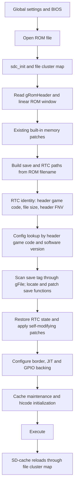

# ROM-hack source-profile lifecycle design

Audit date: 2026-09-05. Fork source: `db97744`. This document proposes a lifecycle;
it does not implement external patching, new identity migration or title rules.

## Current data flow

There is no IPS/UPS external-patch stage in this fork baseline. “Original” and
“effective” are not currently separate metadata objects. Built-in patches change
loaded/backing memory after the original header read. An already-patched input
ROM is simply the opened source file; the loader cannot infer its unmodified
ancestor from its name or game code.

| Consumer | Current source | Required future rule |
| --- | --- | --- |
| existing built-in patches | `gRomHeader.gameCode` read in `loadGbaRom` | explicit choice of original/effective identity; no automatic inherited workaround |
| per-game config | game code + `softwareVersion`, `/_gba/configs/CCCCVV.json` | effective image identity, with provenance and address applicability |
| border | `gRomHeader.gameCode` | documented presentation fallback; must not change patch identity |
| save tag and size | `FindSaveTag(&gFile, ...)`, selected `SaveTypeInfo` | scan effective bytes and bound by effective size |
| save/RTC filename | opened ROM path with replaced extension | preserve existing path behavior until explicit migration exists |
| RTC identity | code + file size + FNV-1a of entire header | avoid original-header/effective-size mixtures; handle incompatible state explicitly |
| RTC capability | generic GPIO object attached at 0x080000C4 | explicit capability evidence; no game-code inference added |
| JIT patch addresses | selected config values, linear/permanent cache backing | validate against effective image revision and range before application |
| cache reload | `gFile.cltbl` and ROM-block mapping | same effective bytes as initial load after every eviction |
| checksum/logo | fields stored in `GbaHeader`; no explicit validator in audited loader path | report effective-header validity separately from source identity and BIOS behavior |

Source anchors: `main.cpp::loadGbaRom`, `loadGameSpecificSettings`,
`handleSave`, `setupJit`, `gbaRunnerMain`; `RomGpio::Initialize` and
`RtcPersistence::Identity`; `SdCache.c::sdc_init` and block-loading routines.
The loader currently does not check all open/read/seek outcomes. A profile layer
must not make an unchecked partial header authoritative.

## Upstream PR #205 conflict map

[PR #205](https://github.com/Gericom/GBARunner3/pull/205) was OPEN at queried head
`b683045d82b1ee046e6df81a548fa9824a8bad63`, base
`ef80000aba387ff05e3b2f6d5481b8816bf5d2a4`. Its patch was inspected, not merged.

| Files in upstream PR | Overlap or integration constraint |
| --- | --- |
| `main.cpp` | calls `gpo_init` after `sdc_init`, then reads header/linear data and calls `gpo_patchLinearChunk`; intersects fork RTC identity, save paths and boot ordering |
| `Patches/GpoBuilder.cpp/.h`, `GpoPatcher.cpp/.h`, `UpsPatcher.cpp/.h` | new effective-size and cluster-map owner; must supply one logical reader and effective metadata commit point |
| `MemoryEmulator/HiCodeCacheMapping.s` and `HiCodeCacheMappingC.c` | moves undefined-data storage and initialization; overlaps fork saved-SPSR/Thumb fixes and hicode layout; preserve those semantics and re-run linked tests |
| `Application/SplashScreen.cpp/.h` | busy-loop lifetime during patch generation; intersects boot and IRQ timing, separate from identity policy |
| `Crc32Table.cpp/.h` | new checksum infrastructure; patch integrity CRC does not substitute for source-profile identity |

PR #205 updates `gFile.obj.objsize` before installing the merged cluster table.
It explicitly patches the linear first-cluster view because FatFs may serve
cluster zero via `obj.sclust`. The inspected main diff reads `gRomHeader` before
`gpo_patchLinearChunk` and does not refresh it afterward. **Inference:** a patch
that changes header bytes can therefore leave metadata different from executed
linear bytes; prove this with a synthetic first-cluster patch before integration.
Likewise verify tag scanning through ordinary `f_read`, not only the cache path.
The PR's reported hardware tests do not establish these identity invariants.

## Proposed identity and required invariants

Maintain an immutable source identity and a separate effective identity.
Each contains byte size, full-content digest when available, parsed header and
parse/validation status. Record patch type/order/digest, schema version and
effective-content digest in a profile manifest. Filename/game code/header hash
alone cannot uniquely identify a hack revision. Digest calculation is a boot-time
or validated-sidecar operation; do not add hashing to runtime cache reads.

1. Check source open/read/seek and header length before constructing identity.
2. Apply/verify the optional patch into a completed effective view. A failed patch
   cannot publish a new size, cluster map or identity while retaining old bytes.
3. Read the effective header and save metadata through that same view, including
   cluster zero, extension/truncation and cache boundaries. Never splice source
   code/header fields together with an effective size.
4. Select settings with explicit provenance. Inheriting source display preferences
   may be acceptable; source JIT/self-modifying addresses require proof of matching
   effective code and cannot be silently inherited by game code alone.
5. Complete identity/config/save decisions before JIT, permanent patch blocks and
   GPIO capture of underlying ROM data. Preserve effective GPIO bytes when reads
   are disabled. Cache eviction/reload must preserve patch and identity generation.
6. Keep `.sav` and `.g3rtc` association stable by default. A profile mismatch must
   preserve existing files and produce a clear incompatibility decision; migration
   and user choice need a separate design. Do not rewrite existing RTC records.
7. Do not add title-specific runtime dispatch, skipped symptoms or arbitrary
   hard-coded ROM offsets to resolve a profile mismatch.

## Staged implementation proposal and tests

First, add an independently tested metadata value object and checked logical
reader contract, without changing config selection. A synthetic file/view adapter
can cover first-cluster patching, noncontiguous backing, shorter/longer targets,
partial reads, changed header game code/version/checksum/logo and unchanged input.

Second, connect source/effective identities to a patch-view transaction and prove
rollback after every interrupted creation/activation step. Compare every initial
linear byte and later cache reload against the same synthetic expected image;
include 0x081FFFFC/0x08200000, mirrors and stale-generation rejection.

Third, design explicit profile lookup with exact effective digest and documented
fallbacks; test identical headers with different content, same filename after
revision replacement, header-only changes, unchanged header with relocated code,
ambiguous matches and out-of-range patch lists. No default address inheritance.

Fourth, review save/RTC association and migration independently. Prove preservation
of old files, cold boot, interrupted writes and recovery before any format change.
Finally integrate boot ordering with PR #205 on an isolated draft branch, compare
section sizes and run pinned build/JIT/cache tests plus the single hardware queue.

No production helper is proposed as ready now: original/effective view ownership
and upstream first-cluster semantics must be settled first. The small metadata
and reader-contract stage is the next bounded design unit, not authorization for
a broad refactor or an automatic merge of PR #205.
